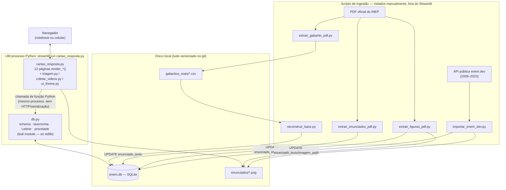

# SYSTEM_DEEP_DIVE.md — ENEM GI, por dentro

Documento de estudo, não documentação de produto. O objetivo não é descrever
"o que o código faz" (isso o `core/CLAUDE.md` já faz, e continua sendo a
referência oficial pra manutenção). O objetivo aqui é outro: te dar munição
pra você explicar esse sistema, sozinho, numa sala com um entrevistador que
vai perguntar "por quê" repetidamente.

**Regras que segui escrevendo isto** (pra você poder confiar no documento):
não inventei nenhuma funcionalidade; não existe Machine Learning no projeto
e este documento não finge que existe; toda decisão "estranha" vem com uma
explicação — e quando o código/comentário não diz o motivo real, o texto diz
explicitamente **"o código não permite determinar isso com certeza"** em vez
de inventar uma justificativa; todo número concreto (contagem de linha,
resultado de query) foi obtido rodando contra o código/banco reais em
2026-09-02, não estimado.

---

# 1. Visão geral do sistema

## Qual problema o sistema resolve

Treinar pra uma prova de larga escala (ENEM) com questões reais gera três
problemas que uma pilha de PDFs e um caderno não resolvem sozinhos:

1. **Memória**: quando revisar cada questão de novo, sem virar loteria (ou
   revisar tudo, ou nunca revisar nada específico).
2. **Direção**: em qual matéria estudar teoria hoje, com base em dado — não
   em qual matéria "parece" fraca ou dá mais ansiedade.
3. **Fragmentação de fonte**: gabarito oficial, resolução em vídeo, o
   enunciado, e o próprio histórico de tentativas vivem em lugares
   diferentes; juntar isso manualmente não escala pra centenas de questões.

O sistema anterior (a pasta `../` na raiz do repo, ver `main.py`/`app.py`)
tentou resolver isso com um CSV único e tinha bugs reais e documentados:
dois scripts gravando esquemas diferentes no mesmo arquivo, e taxonomia
fragmentada por string (`"Matemática Básica"` ≠ `"matemática básica"` pro
CSV, mesmo sendo a mesma matéria pra qualquer humano). `core/` é uma
reescrita do zero desenhada especificamente pra tornar essas duas classes de
bug **impossíveis por construção** — não "menos prováveis", impossíveis: um
banco relacional com schema/tipo centralizado no lugar do CSV, e uma
taxonomia fechada validada em código no lugar de string livre.

## Para quem ele foi criado

Uso pessoal, um usuário só (Gabriel), não é um produto multiusuário. Essa
não é uma limitação incidental — é uma decisão de escopo que aparece em
praticamente toda escolha de arquitetura do sistema: não existe tabela de
usuário, não existe login, não existe isolamento de dado por usuário. Isso
importa muito pra seção 11 (Escalabilidade): "quebrar pra 100 usuários" não
é uma pergunta de performance aqui, é uma pergunta de *o schema nem
representa a ideia de "mais de um usuário"*.

## Como o sistema funciona de ponta a ponta

```
PDF oficial do INEP
   → gabarito extraído (script) → CSV → carregado no SQLite (script)
   → usuário abre o Streamlit, escolhe uma prova, marca A-E por questão
   → "Corrigir" compara cada resposta contra o gabarito gravado
   → cada resposta vira uma linha em tentativas_usuario (histórico) e
     atualiza estado_revisao (Leitner: quando revisar de novo)
   → páginas de análise recalculam, AO VIVO, taxa de acerto/recorrência/
     prioridade de estudo a partir de tentativas_usuario + questoes
   → "Revisão de hoje" busca o que está atrasado em estado_revisao
   → resolução em vídeo (se existir) aparece automaticamente quando o
     usuário erra uma questão
```

Nenhuma dessas etapas depende de rede externa em tempo de uso — a única
etapa que fala com uma API é a coleta de vídeo (YouTube Data API) e a
importação opcional de enunciado via `enem.dev`; corrigir uma prova, ver
estatística e revisar são 100% locais (arquivo SQLite no disco).

## Principais tecnologias

Confirmado direto em `requirements.txt` + imports reais do código — **sem
nenhuma biblioteca de Machine Learning** (nem `sklearn`, nem `tensorflow`,
nem `torch` — busquei no repo inteiro, zero ocorrência):

| Tecnologia | Papel | Onde |
|---|---|---|
| Python 3 (`from __future__ import annotations`, `str \| None`) | linguagem única do projeto | tudo |
| Streamlit ≥1.30 | única camada de UI, também serve HTTP pro navegador | `cartao_resposta.py` e módulos irmãos |
| `sqlite3` (stdlib, **não** um pacote externo) | banco de dados, sem ORM | `db.py` |
| PyMuPDF (`import pymupdf`) | extração de texto/vetor de PDF do INEP | `extrair_enunciados_pdf.py`, `extrair_figuras_pdf.py` |
| `pdftotext` (CLI externo, poppler-utils — não é lib Python) | extração de texto pro gabarito | `extrair_gabarito_pdf.py` (via `subprocess`) |
| pandas | leitura de um CSV auxiliar (vídeos) | `reconstruir_base.py` |
| requests + Pillow | consumir a API pública `enem.dev` e montar imagem | `importar_enem_dev.py` |
| google-api-python-client | YouTube Data API (só busca, **API key**, não OAuth de usuário) | `main.py` |
| python-dotenv | carregar `.env` local | `main.py` |

---

# 2. Arquitetura

## Diagrama



## Responsabilidades de cada camada/módulo

- **UI/aplicação** (`cartao_resposta.py` + `triagem.py` + `coletar_videos.py`
  + `ui_theme.py`): coleta input, chama `db.py`, formata o resultado pra
  tela. Não decide regra de negócio nenhuma — nem corrige prova, nem calcula
  Leitner, nem valida taxonomia. Isso é 100% intencional (ver a "regra de
  camadas" abaixo).
- **Core/backend** (`db.py`): schema, taxonomia fechada, toda regra de
  negócio (correção, Leitner, prioridade de estudo, auditoria). É o único
  lugar que sabe o que é uma "questão", um "acerto" ou uma "revisão".
- **Ingestão** (`reconstruir_base.py` + os 4 scripts de extração):
  transforma fonte externa (PDF, API pública) em chamadas pras mesmas
  funções de `db.py` que a UI usa — não existe um caminho de escrita
  paralelo/privilegiado pros scripts.
- **Armazenamento**: um arquivo SQLite (`enem.db`) + um diretório de PNGs
  (`enunciados/`) + CSVs de gabarito (`gabaritos_reais/`), todos dentro de
  `core/`.

## Fluxo entre Streamlit, backend e banco

Não tem 3 camadas de rede — tem 1 processo com 2 módulos e 1 arquivo:

```
Streamlit (mesmo processo) --import direto--> db.py --sqlite3--> enem.db
```

`cartao_resposta.py` faz `import db` no topo do arquivo (linha 27) e chama
`db.registrar_tentativa(...)`, `db.prioridade_de_estudo(...)` etc como
função Python comum — sem serialização, sem round-trip de rede, sem
autenticação de serviço. `db._conectar()` (linha 348) é um
`@contextmanager` que abre uma conexão sqlite3 nova, faz
`PRAGMA foreign_keys = ON`, e no fim faz `commit()` (ou `rollback()` se uma
exceção subiu) e fecha a conexão — **uma conexão por chamada de função**,
não uma conexão persistente nem um pool.

## Por que essa arquitetura foi escolhida

Isto é, em parte, **inferência bem apoiada em evidência indireta** (nenhum
comentário do projeto diz literalmente "escolhi Streamlit porque X") — mas
apoiada em fatos observáveis: é um projeto de 1 desenvolvedor pra 1 usuário,
sem verba/motivo pra manter infraestrutura separada, com o objetivo
explícito (documentado em `DEPLOY.md`) de rodar "de qualquer lugar, de
graça", via Streamlit Community Cloud. Streamlit resolve, com uma dependência
só, exatamente os dois problemas que mais importam nesse contexto: (1) UI
sem escrever HTML/CSS/JS separado, e (2) deploy de graça com **zero**
configuração de servidor. Um monolito de processo único é a escolha correta
pra esse escopo — não é uma limitação a esconder, é a decisão certa pro
tamanho real do problema.

## Vantagens e limitações da arquitetura atual

**Vantagens (observadas, não hipotéticas):**
- Deploy trivial: `git push` atualiza o app sozinho (`DEPLOY.md`).
- Zero custo de serialização/rede entre "front" e "back" — é uma chamada de
  função.
- Mudança de schema é imediata: não existe contrato de API versionado pra
  quebrar.
- Debug simples: um processo, um stack trace, sem precisar correlacionar
  logs de dois serviços.

**Limitações (também observadas, direto no código):**
- **Não existe conceito de usuário no schema.** Isso não é "escalabilidade
  ruim", é ausência total da feature — ver seção 11.
- **SQLite sem WAL configurado.** O único `PRAGMA` que `db.py` roda é
  `foreign_keys = ON` (linha ~352) — não há `PRAGMA journal_mode=WAL`. No
  modo padrão (rollback journal), SQLite serializa escritores mais
  agressivamente do que precisaria. Pra 1 usuário isso nunca aparece; é
  relevante só se a arquitetura crescer sem trocar de banco.
- **N+1 real, não hipotético.** `simulados_feitos()` (`db.py:1654`) roda uma
  query pra listar provas distintas e depois, **dentro de um loop Python**,
  chama `resumo_por_tentativa()` e `nomes_tentativas()` — cada uma sua
  própria query — uma vez por prova. `progresso_simulados()` faz o mesmo
  padrão (3 queries por combinação de simulado). Com 7-9 provas cadastradas
  isso é invisível; com milhares, seria o primeiro ponto a doer.
- **Todo agregado é recalculado do zero, sempre.** `prioridade_de_estudo()`,
  `recorrencia_por_materia()`, `taxa_acerto_por_materia()` fazem `GROUP BY`
  sobre a tabela inteira a cada carregamento de página — sem cache, sem
  view materializada. Funciona bem com 587 tentativas; não teria motivo pra
  ainda funcionar bem com milhões.
- **Acoplamento ao processo Streamlit.** `db.py` é desacoplado de UI *dentro*
  do projeto (a regra de camadas abaixo), mas ainda assim só é alcançável
  chamando Python direto — não existe forma de outro processo (um app
  mobile nativo, por exemplo) ler os mesmos dados sem reimplementar uma API
  por cima de `db.py`.

## O que mudaria caso o sistema crescesse muito

1. **Multiusuário de verdade primeiro**, antes de qualquer outra coisa:
   tabela `usuarios`, `usuario_id` em toda tabela que hoje é implicitamente
   "do Gabriel" (`tentativas_usuario`, `estado_revisao`, `redacoes`,
   `configuracoes`, `historico_alteracoes`), autenticação, e todo `WHERE`
   de `db.py` ganhando `AND usuario_id = ?`.
2. **SQLite → Postgres** (ou MySQL) no momento em que escrita concorrente de
   verdade aparecer — não antes, seria complexidade sem benefício hoje.
3. **`db.py` atrás de uma API real** (FastAPI é o candidato natural: mesmo
   ecossistema Python, tipagem via Pydantic combina com o estilo já usado em
   `db.py` com `from __future__ import annotations`), permitindo qualquer
   client (Streamlit, mobile, outro time) consumir os mesmos dados sem
   reimplementar a lógica de negócio.
4. **Cache/materialização pros agregados** (Redis, ou mesmo uma tabela
   `estatisticas_materia` recalculada por job, em vez de `GROUP BY` a cada
   request).
5. **Object storage pras imagens** (`enunciados/*.png` sai do disco local
   pra algo tipo S3 + CDN) — hoje 12 MB em 202 arquivos, comitados no git,
   o que já é um cheiro de "isso não deveria estar no controle de versão"
   numa escala maior.

---

# 3. Backend

Os módulos que rodam **toda vez que o app está no ar** (a "aplicação" em si
— os scripts de ingestão, que rodam raramente e manualmente, estão na
seção 7).

## `db.py` — o núcleo

- **O que faz**: schema (via `schema.sql`), taxonomia fechada, inserção
  canônica de questão, registro de tentativa, cálculo de Leitner, todas as
  consultas analíticas (prioridade, recorrência, taxa de acerto, streak,
  nível de jogador), CRUD de redação.
- **Entradas**: chamadas de função Python com tipos primitivos (`str`,
  `int`, `date`) ou dict/list simples — nunca um objeto de request HTTP,
  nunca um DataFrame.
- **Saídas**: `dict`/`list[dict]` simples (nunca um objeto ORM, nunca um
  `Row` do sqlite3 exposto pra fora do módulo — toda função que lê do banco
  converte a tupla crua num dict antes de retornar, ex. `_linha_para_questao_grade()`).
- **Quem depende dele**: todo o resto de `core/` (`cartao_resposta.py`,
  `triagem.py`, `coletar_videos.py`, `backup_db.py` indiretamente via
  `db.DB_PATH`, `reconstruir_base.py`) e os 4 scripts de extração (via
  `db.atualizar_enunciado()`/`db.detalhe_questao()`/`db.gerar_id_canonico()`).
  **Zero módulos dependem de `main.py`/`app.py`** a partir de `db.py`.
- **Decisões importantes de implementação:**
  - **Zero dependência externa** (só stdlib — `csv`, `io`, `re`, `sqlite3`,
    `unicodedata`, `contextlib`, `datetime`, `pathlib`). Declarado
    explicitamente no docstring do arquivo. Consequência direta: nada de
    ORM (SQLAlchemy seria uma dependência externa), nada de Pydantic pra
    validação (é tudo `if`/`raise ValueError` manual).
  - **`id_questao` canônico como chave primária** (`"{ano}_{caderno}_{numero}"`,
    ex. `2024_azul_136`), gerado por `gerar_id_canonico()`, com o `caderno`
    passando por `normalizar_texto()` antes — isso existe especificamente
    pra impedir que `"Azul"` e `"azul"` virem duas chaves diferentes (o
    exato bug de fragmentação de string que o sistema antigo tinha).
  - **`sobrescrever=True` faz muito mais que um UPDATE simples**
    (`inserir_questao()`, linha ~432): se o gabarito mudar de verdade,
    recalcula `resultado` de **toda** tentativa já registrada contra o
    gabarito novo e grava uma entrada em `historico_alteracoes` — porque o
    id_questao não muda, então as `tentativas_usuario`/`resolucoes` que já
    apontavam pra essa questão continuam válidas, só que agora avaliadas
    contra a resposta certa.
  - **Um único ponto de escrita pro par tentativa/revisão**:
    `registrar_tentativa()` é a única função com permissão de escrever em
    `tentativas_usuario` E `estado_revisao` juntas — o próprio docstring diz
    que isso existe "pra evitar os dois divergirem por escritas separadas".
  - **Replay completo em vez de ajuste incremental**
    (`_recomputar_estado_revisao()`, linha ~626): editar ou apagar QUALQUER
    tentativa no meio do histórico de uma questão reconstrói o streak do
    zero, reproduzindo Leitner sobre tudo que sobrou, em vez de tentar
    "consertar" o valor atual. Motivo declarado: streak/intervalo são
    cumulativos, então um patch incremental arriscaria ficar sutilmente
    errado.
- **Possíveis problemas ou limitações:**
  - As consultas analíticas fazem `SELECT ... GROUP BY` sobre a tabela
    inteira a cada chamada — sem cache (ver seção 2).
  - `desfazer_tentativas()` só desfaz uma questão sem histórico anterior —
    documentado como limitação deliberada ("sem caso de uso real pra
    justificar esse risco agora"), não um bug esquecido.
  - Nenhuma função de `db.py` tem teste automatizado — só o bloco
    `if __name__ == "__main__"` no fim do arquivo, que é um smoke test
    manual (imprime resultado pra inspeção visual, não faz `assert`).

## `cartao_resposta.py` — a aplicação Streamlit

- **O que faz**: entrypoint único; 12 páginas (`render_*`), navegação por
  `?pagina=` na URL (não `st.sidebar.radio`); a peça central é
  `_renderizar_grade_questoes()` (linha 359) — o núcleo compartilhado de
  grade de resposta + correção + revisão de erro, reusado por "Uma prova
  por vez", "Simulado completo", "Revisão de hoje", "Praticar por matéria" e
  "Prova com enunciado (beta)".
- **Entradas**: interação do usuário via widgets Streamlit (`st.radio`,
  `st.file_uploader`, `st.button`, etc), que o Streamlit converte em
  reruns do script inteiro.
- **Saídas**: HTML/JS renderizado pelo runtime do Streamlit no navegador; e
  **como efeito colateral**, chamadas de escrita em `db.py`.
- **Quem depende dele**: ninguém dentro do projeto (é o topo da árvore) —
  só é executado, nunca importado por outro módulo do `core/`.
- **Decisões importantes de implementação:**
  - **Navegação por query param em vez de `st.sidebar`**: comentário no
    `__main__` (linha ~1511) documenta que a sidebar nativa "abre FECHADA
    por padrão em tela estreita" e o botão de abrir "ficou inacessível no
    celular do Gabriel mesmo depois de ajustar o CSS (reportado em
    produção 2x)" — decisão tomada depois de um problema real observado,
    não preferência estética.
  - **`st.form` + `st.session_state` pra sobreviver ao rerun**: toda grade
    de resposta usa `key=f"resp_{q['id_questao']}"` — sem essa chave
    estável, o Streamlit perderia a resposta marcada a cada rerun. O botão
    "Corrigir" só existe *dentro* do form porque `st.form` permite um botão
    de submit só; o editor de enunciado (upload de imagem/texto) roda
    **fora** do form justamente por essa restrição.
  - **`st.columns(3)` recriado a cada linha de 3**, não uma vez pra grade
    inteira (comentário na linha ~438): no celular, onde Streamlit empilha
    colunas na vertical, uma única `st.columns(3)` pra tudo faria a leitura
    saltar (Q1,Q4,Q7...,Q2,Q5,Q8...) em vez de sequencial — um bug de UX
    real, encontrado e documentado, não uma escolha arbitrária.
  - **`format_func=lambda letra, alt=alternativas: ...`** (linha ~430):
    o parâmetro default `alt=alternativas` existe pra não deixar a lambda
    fechar sobre a variável de loop `alternativas`, que o Python só resolve
    no momento da chamada — sem isso, qualquer código que guardasse essa
    função pra invocar depois (o próprio comentário cita `AppTest`) pegaria
    o valor da ÚLTIMA iteração do loop pra QUALQUER questão.
- **Possíveis problemas ou limitações:**
  - **`st.file_uploader` sem gate de botão é uma armadilha conhecida do
    Streamlit**, documentada no próprio código: um `if arquivo: salvar()`
    incondicional re-salva o mesmo arquivo a cada rerun pra sempre — já
    aconteceu uma vez de verdade ("um teste de upload virou ~500 cópias em
    segundos"), corrigido gateando atrás de botão + chave incremental. Todo
    uploader novo precisa lembrar dessa regra; nada no Streamlit força isso
    automaticamente.
  - 1548 linhas num arquivo só, sem separação por página em módulos — funciona
    porque o volume de páginas ainda é gerenciável, mas cresce sem limite
    natural (não há uma convenção de "1 arquivo por página" imposta).

## `triagem.py`, `coletar_videos.py`, `backup_db.py` — módulos de suporte

| Módulo | O que faz | Entrada | Saída | Decisão-chave |
|---|---|---|---|---|
| `triagem.py` (101 linhas) | classifica manualmente questão `nao_classificado` | escolha de matéria via `st.selectbox` (lista fechada, nunca texto livre) | `UPDATE questoes` via `db.inserir_questao(sobrescrever=True)` **+** append em `gabaritos_reais/correcoes_manuais.csv` | grava em dois lugares de propósito — sem o CSV, a classificação manual "voltava sozinha" toda vez que `reconstruir_base.py` rodava, porque esse script reconstrói só a partir do gabarito oficial |
| `coletar_videos.py` (500 linhas) | liga vídeo/texto de resolução a questões, com 4 modos (avulso, lote-resumo, junção, playlist) | título/descrição de vídeo do YouTube (via `main.py`) ou texto colado pelo usuário | `INSERT` em `resolucoes` (+ `UPDATE materia` quando a questão ainda está pendente) | cross-caderno automático: se a descrição do vídeo trouxer o bloco `"Caderno X - N"` pras outras cores, o mesmo vídeo é ligado às OUTRAS provas também, não só à cor sendo coletada — ver `extrair_cadernos_da_descricao()` |
| `backup_db.py` (63 linhas) | copia `enem.db` pra `backups/enem_<timestamp>.db` | nenhuma (lê `db.DB_PATH`) | arquivo novo em `backups/` | não apaga backup antigo — quem decide o que limpar é a pessoa; `backups/` é local e gitignored, então **não protege contra disco morto**, só contra erro de operação |

## `ui_theme.py` (381 linhas)

CSS complementar ao `.streamlit/config.toml` — esconde o rodapé "Made with
Streamlit", estiliza métricas/bolhas de resposta, mantém a gaveta de
navegação lateral num visual escuro deliberadamente diferente do resto do
app (é "chrome" de navegação, não conteúdo de leitura, então não precisa
seguir o tema claro). Chamado uma vez por rerun (`injetar_tema()`), que é
barato — só injeta uma tag `<style>`.

---

# 4. Banco de dados

## SQLite

Um arquivo (`core/enem.db`, hoje **811 008 bytes**) acessado via o módulo
`sqlite3` da standard library — nenhum driver externo, nenhum servidor de
banco rodando à parte. `PRAGMA foreign_keys = ON` é setado em toda conexão
aberta por `_conectar()` porque **o SQLite não garante integridade
referencial por padrão** — sem esse pragma, um `ON DELETE CASCADE` no schema
seria ignorado silenciosamente.

## Tabelas (com linhas reais, hoje)

| Tabela | Linhas | Chave primária |
|---|---|---|
| `questoes` | 754 | `id_questao` (TEXT) |
| `tentativas_usuario` | 587 | `id_tentativa` (INTEGER AUTOINCREMENT) |
| `estado_revisao` | 468 | `id_questao` (TEXT, também FK) |
| `resolucoes` | 536 | `id_resolucao` (INTEGER AUTOINCREMENT) |
| `historico_alteracoes` | 499 | `id` (INTEGER AUTOINCREMENT) |
| `topicos_validos` | 89 | (`grande_area`, `materia`) composta |
| `configuracoes` | 3 | `chave` (TEXT) |
| `redacoes` | 1 | `id` (INTEGER AUTOINCREMENT) |
| `nomes_tentativas` | 0 | (`ano`,`caderno`,`grande_area`,`numero_tentativa`) composta |

## Diagrama ER

```mermaid
erDiagram
    QUESTOES ||--o{ RESOLUCOES : "tem N resoluções"
    QUESTOES ||--o{ TENTATIVAS_USUARIO : "recebe N tentativas"
    QUESTOES ||--o| ESTADO_REVISAO : "tem no máx. 1 estado atual"
    QUESTOES ||--o{ HISTORICO_ALTERACOES : "pode ter N alterações auditadas"

    QUESTOES {
        text id_questao PK "ano_caderno_numero, ex 2024_azul_136"
        int ano
        text caderno
        int numero_questao
        text grande_area
        text materia
        text alternativa_correta "CHECK A-E"
        text status_classificacao "classificado | nao_classificado"
        text enunciado_texto "nullable"
        text enunciado_imagem_path "nullable"
    }
    RESOLUCOES {
        int id_resolucao PK
        text id_questao FK
        text tipo "video | texto"
        text conteudo
        text canal "nullable"
    }
    TENTATIVAS_USUARIO {
        int id_tentativa PK
        text id_questao FK
        text resposta_escolhida "A-E OU NULL = em branco"
        text resultado "acertou | errou"
        int streak_acertos
        int intervalo_dias
        text proxima_revisao
        text tipo_erro "nullable"
    }
    ESTADO_REVISAO {
        text id_questao PK_FK
        int streak_acertos
        int intervalo_dias
        text proxima_revisao
        text ultima_tentativa
    }
    HISTORICO_ALTERACOES {
        int id PK
        text id_questao "sem FK formal"
        text campo
        text valor_antigo
        text valor_novo
        int tentativas_recalculadas
    }
    TOPICOS_VALIDOS {
        text grande_area PK
        text materia PK
    }
    NOMES_TENTATIVAS {
        int ano PK
        text caderno PK
        text grande_area PK
        int numero_tentativa PK
        text nome
    }
    REDACOES {
        int id PK
        text tema
        text data_escrita
        text texto "nullable"
        int nota "nullable"
        text fonte_correcao "nullable"
    }
    CONFIGURACOES {
        text chave PK
        text valor
    }
```

`TOPICOS_VALIDOS`, `NOMES_TENTATIVAS`, `REDACOES` e `CONFIGURACOES`
aparecem **sem linha de relacionamento** no diagrama de propósito — nenhuma
delas tem uma `FOREIGN KEY` de verdade ligando a `QUESTOES` (a ausência de
FK pra `TOPICOS_VALIDOS` é uma decisão deliberada, ver abaixo; as outras
três simplesmente não precisam).

## Chaves

- **Primárias simples**: `questoes.id_questao` (TEXT, canônico, nunca um
  `INTEGER AUTOINCREMENT` — a identidade de uma questão é o que ela É
  — ano/caderno/número — não a ordem em que foi inserida no banco).
- **Primárias compostas**: `topicos_validos (grande_area, materia)` e
  `nomes_tentativas (ano, caderno, grande_area, numero_tentativa)` — nos
  dois casos, a combinação de colunas *é* a identidade natural do dado, uma
  chave sintética adicionaria uma indireção sem necessidade.
- **Estrangeiras com `ON DELETE CASCADE`**: `resolucoes.id_questao`,
  `tentativas_usuario.id_questao`, `estado_revisao.id_questao` — todas
  apontando pra `questoes.id_questao`. Na prática, porém, `apagar_questao()`
  e `apagar_prova()` em `db.py` fazem os `DELETE` explicitamente em cada
  tabela, **em vez de confiar só no cascade** — o comentário do código diz
  que isso é de propósito, "pra funcionar mesmo se o schema não tiver
  cascade configurado" (defesa em profundidade, não redundância por
  descuido).

## Índices (existem, todos deliberados por padrão de consulta)

`idx_questoes_materia`, `idx_questoes_status`, `idx_resolucoes_questao`,
`idx_tentativas_questao`, `idx_tentativas_data`,
`idx_estado_proxima_revisao`, `idx_historico_questao`,
`idx_redacoes_data`. Cada um existe porque uma função de `db.py` filtra por
essa coluna: `idx_estado_proxima_revisao`, por exemplo, é exatamente o que
faz `questoes_para_revisar()` (`WHERE proxima_revisao <= ?`) não precisar
varrer `estado_revisao` inteira todo santo dia.

## Por que cada tabela existe

Já coberto em detalhe na seção 3 (`db.py`) e no diagrama acima — o ponto que
vale reforçar aqui é que **cada tabela nova no schema corresponde a um bug
específico que o sistema anterior tinha** (comentário no topo do próprio
`schema.sql`): `resolucoes` existe porque o CSV antigo só suportava 1 vídeo
por questão; `estado_revisao` separado de `tentativas_usuario` existe porque
o `.update()` do sistema antigo confundia "o que aconteceu" com "o que fazer
agora"; `topicos_validos` existe porque a taxonomia livre fragmentava.

## Diferença entre dados históricos e estado atual

Esta é a decisão de modelagem mais importante do schema inteiro, então vale
nomear explicitamente o padrão: **log imutável + ponteiro mutável derivado
dele**.

- `tentativas_usuario` é o **log**: toda tentativa, pra sempre, na ordem em
  que aconteceu, nunca editada in-loco em uso normal (as exceções — desfazer,
  editar resposta, apagar rodada — são deliberadas e sempre disparam um
  *replay* completo, nunca um ajuste pontual).
- `estado_revisao` é o **estado**: 1 linha por questão já tentada, sempre
  *derivável do zero* a partir do log (`_recomputar_estado_revisao()`
  literalmente faz isso). Se `estado_revisao` sumisse inteira, dar pra
  reconstruí-la 100% a partir de `tentativas_usuario` — ela não carrega
  nenhuma informação que não exista, em forma bruta, no log.

Esse padrão (log de eventos imutável → estado projetado a partir dele) é o
mesmo princípio por trás de *event sourcing* em sistemas maiores — aqui
implementado "à mão", sem framework, porque a escala não pede um.

## Decisões de modelagem (resumo direto)

- `id_questao` como string canônica em vez de inteiro sintético — identidade
  legível e estável sem precisar de uma segunda tabela de lookup.
- Matemática e Ciências do mesmo ano/caderno são **duas "provas" totalmente
  separadas** (nunca uma grade de 45+44 questões junta) — decisão de
  produto (cada área conta como simulado próprio pras estatísticas),
  não uma limitação técnica.
- `resposta_escolhida` aceita `NULL` deliberadamente — em branco é uma
  tentativa real, não "nenhuma tentativa" (afeta `taxa_acerto`,
  `prioridade_de_estudo`, Leitner — todos contam o branco como erro).
- Sem `FOREIGN KEY` de `questoes` pra `topicos_validos` — **de propósito**:
  uma matéria fora da taxonomia ainda precisa ser **gravada** (com
  `status_classificacao='nao_classificado'`), nunca rejeitada pelo banco. Um
  `FOREIGN KEY` rígido aqui tornaria essa gravação impossível e perderia o
  dado.

## Possíveis problemas de escalabilidade

- SQLite permite **um único escritor por vez** no banco inteiro (mesmo com
  WAL, que nem está configurado aqui) — para 1 usuário isso nunca aparece;
  seria o primeiro limite real num cenário multiusuário concorrente.
- `historico_alteracoes.id_questao` **não tem `FOREIGN KEY`** pra
  `questoes.id_questao` (só tem índice) — decisão implícita, provavelmente
  porque o histórico precisa sobreviver mesmo depois que a questão foi
  apagada (`apagar_questao()`/`apagar_prova()` logam a exclusão ali antes de
  remover a linha de `questoes`) — **o código não permite determinar com
  certeza se essa ausência de FK foi uma decisão deliberada ou um
  descuido**, mas o comportamento observado (logar antes de apagar) é
  consistente com "deliberada".
- Nenhum particionamento/arquivamento de `tentativas_usuario` — cresce sem
  limite, sempre lida inteira quando uma questão específica pede seu
  histórico completo (`_recomputar_estado_revisao`); em milhões de linhas
  isso ainda seria rápido por causa do índice em `id_questao`, mas
  qualquer agregado *sem* filtro por questão (`resumo_geral_desempenho()`,
  por exemplo) faria table scan completo.

---

# 5. Fluxo de dados — passo a passo

Do PDF até a tela, uma questão real percorre este caminho:

1. **Entrada (gabarito)**: `extrair_gabarito_pdf.py` lê o PDF oficial via
   `pdftotext -layout`, extrai pares `(número, letra)` por regex, valida que
   **toda** questão da faixa (91-135 ou 136-180) apareceu com letra OU como
   anulada — se sobrar alguma sem explicação, o script **recusa** gerar o
   CSV. Grava `gabaritos_reais/gabarito_<ano>_<caderno>_OFICIAL.csv` com
   `materia` = placeholder `SEM_VIDEO_PENDENTE` (o PDF não traz assunto).
2. **Processamento (carga no banco)**: `reconstruir_base.py` varre todos os
   CSVs em `gabaritos_reais/` e chama `db.carregar_gabarito_csv(...,
   sobrescrever=True, preservar_materia_classificada=True)` — o segundo flag
   garante que, se a questão já tinha uma matéria de verdade (vinda de vídeo
   ou triagem), o placeholder do CSV **não** derruba essa classificação.
   Cada linha passa por `db.inserir_questao()`, que gera o `id_questao`
   canônico e testa `(grande_area, materia)` contra `TAXONOMIA_VALIDA` —
   bate: `status_classificacao='classificado'`; não bate:
   `'nao_classificado'`, mas a linha **é gravada de qualquer jeito**.
3. **Armazenamento**: a linha existe agora em `questoes`. Ainda sem
   enunciado, sem imagem, sem resolução, sem tentativa nenhuma.
4. **Enriquecimento (texto/imagem)**: um dos 3 scripts de enunciado (seção
   7) roda depois, separadamente, e só faz `UPDATE questoes SET
   enunciado_texto = ...` via `db.atualizar_enunciado()` — nunca insere
   linha nova.
5. **Tentativa do usuário**: na tela, o usuário marca A-E (ou deixa em
   branco) pra cada questão da grade e clica "Corrigir". Isso chama
   `db.registrar_tentativa(id_questao, resposta)` uma vez por questão.
   Dentro dessa função: busca `alternativa_correta` da própria `questoes`,
   compara, decide `'acertou'`/`'errou'`, chama
   `calcular_proxima_revisao()` (lê o streak atual de `estado_revisao`,
   aplica `_calcular_leitner()`), grava **uma linha nova** em
   `tentativas_usuario` e faz um `UPSERT` em `estado_revisao` — os dois
   `INSERT`s acontecem dentro da mesma conexão/transação (`with
   _conectar() as conn`), então ou os dois commitam juntos ou nenhum
   commita (rollback automático se algo lançar exceção no meio).
6. **Cálculo de prioridade**: em qualquer tela de análise, `db.py` roda, ao
   vivo (sem cache): `recorrencia_por_materia()` (em quantas provas
   carregadas aquela matéria aparece) e `taxa_acerto_por_materia()` (%
   de acerto real nas tentativas daquela matéria), depois
   `prioridade_de_estudo()` cruza os dois: `score = peso_recorrencia *
   %recorrência + (1 - peso_recorrencia) * %erro`.
7. **Revisão**: `questoes_para_revisar()` faz um `SELECT id_questao FROM
   estado_revisao WHERE proxima_revisao <= hoje` — é a fila de "Revisão de
   hoje", ordenada pela data mais atrasada primeiro.
8. **Apresentação**: qualquer uma dessas listas de questões (prova inteira,
   fila de revisão, questões de uma matéria) passa pelo mesmo
   `_renderizar_grade_questoes()` em `cartao_resposta.py` — um único
   caminho de renderização pra qualquer origem da lista, o que é
   exatamente por que o código dessa função foi extraído (comentário
   próprio) "pra poder ser reusado por mais de um modo".

---

# 6. Algoritmo de revisão

## Leitner (simplificado)

Implementado em `_calcular_leitner()` (`db.py:595`) — **8 linhas de código**
que resolvem repetição espaçada sem nenhuma biblioteca:

```python
def _calcular_leitner(streak_anterior, resultado):
    if resultado == "errou":
        return 0, 1                       # zera streak, revisa amanhã
    novo_streak = streak_anterior + 1
    novo_intervalo = min(2 ** (novo_streak - 1), TETO_INTERVALO_DIAS)
    return novo_streak, novo_intervalo
```

Regra em português: **errou → streak zera, revisa em 1 dia. Acertou → streak
sobe 1, intervalo dobra** (2^(streak-1) dias), até um teto de 90 dias
(`TETO_INTERVALO_DIAS`).

**Tabela concreta de progressão** (a partir de streak 0, todas certas
seguidas):

| Streak após acerto | Intervalo até a próxima revisão |
|---|---|
| 1 (1º acerto) | 1 dia |
| 2 | 2 dias |
| 3 | 4 dias |
| 4 | 8 dias |
| 5 | 16 dias |
| 6 | 32 dias |
| 7 | 64 dias |
| 8 | 90 dias (2⁷=128, mas o teto trava em 90) |
| 9+ | continua em 90 (o teto nunca é ultrapassado) |

**Exemplo concreto de verdade** (do próprio `if __name__ == "__main__"` de
`db.py`, linhas finais): questão `2022_azul_155` — 1ª tentativa "A" (errado,
gabarito é "C") → streak 0, revisão em 1 dia. 2ª tentativa "C" (certo) →
streak 1, revisão em 1 dia. 3ª tentativa "C" (certo de novo) → streak 2,
revisão em **2 dias**.

**Por que recalcular do zero em vez de ajustar incrementalmente**: o
intervalo nunca é "intervalo anterior × 2", é sempre `2^(streak-1)`
calculado a partir do streak puro. Isso significa que o número nunca
"deriva" por acúmulo de erro de estado — é sempre 100% reconstruível a
partir do histórico bruto em `tentativas_usuario`. É esse mesmo princípio
que permite `_recomputar_estado_revisao()` existir: editar uma tentativa no
meio do histórico só precisa dar *replay* em tudo que sobrou, streak 0 pra
cima, e o resultado final está garantido correto — não tem "estado
intermediário corrompido" possível.

## Estado de revisão

`estado_revisao` guarda, por questão já tentada ao menos uma vez:
`streak_acertos`, `intervalo_dias`, `proxima_revisao`, `ultima_tentativa`.
É **sempre** uma projeção de `tentativas_usuario` — nunca uma fonte de
verdade independente. A fila "Revisão de hoje" é literalmente `SELECT
id_questao FROM estado_revisao WHERE proxima_revisao <= hoje`.

## Cálculo de prioridade

`prioridade_de_estudo(grande_area, peso_recorrencia=0.5)` (`db.py:1211`)
cruza duas métricas independentes:

- **Recorrência** (`recorrencia_por_materia()`): em quantas provas
  carregadas (do denominador certo — só provas daquela `grande_area`) a
  matéria aparece, em %.
- **Taxa de erro** (`100 - taxa_acerto_por_materia() × 100`): o oposto da
  taxa de acerto real, calculada só sobre questões `status_classificacao=
  'classificado'` (uma questão pendente de triagem não conta como "matéria
  de verdade" pra essa estatística).

```
score = peso_recorrencia × %recorrência + (1 - peso_recorrencia) × %erro
```

**Exemplo real, calculado agora (2026-09-02) rodando a função de verdade
contra o banco atual**, área Ciências da Natureza:

| Matéria | Recorrência | Taxa de acerto | Tentativas | Score de prioridade |
|---|---|---|---|---|
| eletrodinamica | 50,0% | 22,2% | 9 | **63,9** |
| solucoes | 37,5% | 0,0% | 3 | 68,8 |
| optica | 37,5% | 0,0% | 3 | 68,8 |

Conferindo a conta pra eletrodinâmica na mão: `%erro = 100 - 22,2 = 77,8`.
`score = 0,5 × 50,0 + 0,5 × 77,8 = 25,0 + 38,9 = 63,9`. Bate exatamente com
o que a função devolveu — é literalmente essa aritmética, sem nada oculto.

**Matéria recorrente nunca tentada** vai pra uma lista `sem_dados`
separada, **fora** do ranking numérico — a função se recusa a inventar um
score de desempenho sem nenhuma tentativa real (comentário no código:
"seria o mesmo erro que já corrigimos na tabela de probabilidade do sistema
antigo").

## Taxa de erro e recorrência (detalhe)

`taxa_acerto_por_materia()` faz um `GROUP BY q.materia` sobre
`tentativas_usuario JOIN questoes`, filtrando por `grande_area` e por
`status_classificacao='classificado'`. `MIN_AMOSTRA_CONFIAVEL = 3`: abaixo
de 3 tentativas, o resultado ainda aparece no ranking, mas marcado
`amostra_pequena=True` — vira "pista", não "veredito" (é exatamente o
`⚠️` que aparece na UI).

## Por que heurísticas foram usadas (em vez de um modelo)

Três motivos, dois deles verificáveis diretamente no código/dado, um
inferido com razoável confiança:

1. **Volume de dado real**: 587 tentativas no total, geradas por 1 pessoa
   só. Não é "pouco dado pra um modelo simples" — é estruturalmente pouco
   dado pra qualquer modelo estatístico não-trivial generalizar (fato
   observado: contagem real da tabela).
2. **A fórmula já é auditável e explicável em uma frase** — "quanto mais
   cai e mais você erra, maior a prioridade" é algo que dá pra explicar (e
   *confiar*) sem abrir uma caixa preta. Pra uma ferramenta de estudo
   pessoal, onde o usuário PRECISA confiar no ranking pra agir sobre ele,
   isso é uma vantagem real, não só uma desculpa pra não implementar ML.
3. **Inferência**: dado que o projeto inteiro (ver `core/CLAUDE.md`) é
   construído com muito cuidado sobre "nunca inventar confiança que não
   existe" (a lista `sem_dados` acima é exatamente isso), é consistente
   que qualquer modelo estatístico que exigisse mais dado do que existe
   fosse evitado por princípio, não só por falta de tempo — **mas o código
   não permite confirmar essa motivação com certeza**, é uma leitura do
   padrão geral do projeto, não uma frase escrita em algum lugar.

## Por que ainda NÃO existe Machine Learning

Fato direto, não interpretação: busquei `sklearn`, `tensorflow`, `torch`,
`xgboost`, "classificador", "embedding" no `requirements.txt` e no código
inteiro do repositório — **zero ocorrência**. As três coisas que mais
parecem ML de longe são heurísticas determinísticas:

| Parece ML | É de verdade |
|---|---|
| Repetição espaçada | fórmula fixa (`2^(streak-1)`, capada), sem parâmetro aprendido de dado nenhum |
| Prioridade de estudo | média ponderada de duas métricas SQL, pesos fixos passados como argumento |
| Classificação de matéria | dicionário de sinônimos (`SINONIMOS_MATERIA`) + regex de família (`_PADROES_MATERIA`) — nenhum texto novo é "aprendido", cada regra foi escrita à mão observando dado real |

Ver seção 10 pra uma discussão completa de onde ML/LLM poderiam entrar no
futuro.

---

# 7. Pipeline de dados do ENEM

## De onde vêm os dados

Duas fontes externas, nenhuma delas uma API paga ou um serviço mantido pelo
projeto: **PDFs oficiais do INEP** (baixados manualmente pelo usuário, fora
do repositório) e a **API pública `enem.dev`** (`https://api.enem.dev`,
cobre 2009-2023 — confirmado por 404 direto da API pra 2024 no momento em
que o script foi escrito).

## Como gabaritos são processados

`extrair_gabarito_pdf.py` roda `pdftotext -layout` (dependência de sistema,
não Python — precisa do poppler-utils instalado) sobre o PDF de gabarito e
extrai pares `\b(\d{2,3})\s+([A-E])\b` via regex, restritos à faixa de
questão certa (136-180 Matemática, 91-135 Ciências, via `--ciencias`).
Detecta questão anulada de dois jeitos (formato de rodapé "* Questão N
Anulada", usado em 2019/2020, e marcação inline "N Anulada", usado em
2021-2025 — **dois formatos reais, confirmados por PDF**, não um só). Se
sobrar alguma questão da faixa sem gabarito NEM marcação de anulada, o
script **levanta exceção e recusa gerar o CSV** — prefere falhar visível a
gerar dado incompleto silencioso. `reconstruir_base.py` depois varre
`gabaritos_reais/*_OFICIAL.csv` e carrega tudo via
`db.carregar_gabarito_csv(sobrescrever=True,
preservar_materia_classificada=True)`.

## Como questões (texto) são obtidas

Três fontes complementares, camada sobre camada, todas terminando na mesma
função (`db.atualizar_enunciado()`), então o formato final é sempre igual
não importa a origem:

1. **`extrair_enunciados_pdf.py`** (PyMuPDF, `page.get_text()`): extrai
   texto por questão, reconstrói parágrafos que vêm quebrados linha-a-linha
   por causa de justificação, corrige ligaduras tipográficas ("fi"/"fl"
   soltas). Detecta menção a figura/gráfico/tabela por palavra-chave
   (`_PADRAO_CITA_FIGURA`) e prefixa um aviso ⚠️ — testado contra um PDF
   real (2020 azul): **~39% das questões** citam algo assim no texto.
2. **`extrair_figuras_pdf.py`** (`page.cluster_drawings()`, nativo do
   PyMuPDF — sem nenhum modelo, sem serviço externo): agrupa traços
   vetoriais próximos num retângulo e recorta como PNG, associando ao
   marcador "Questão N" mais próximo antes dele na ordem de leitura
   (esquerda→direita por coluna). Tem uma exceção real e documentada: numa
   questão cujas 5 alternativas são diagrama (física de circuito, questão
   93 do 2020 azul), o INEP às vezes usa a largura da página inteira em vez
   de respeitar a coluna — sem tratar isso, 2 das 5 imagens grudavam
   **silenciosamente na questão seguinte**. `_duas_colunas_de_verdade()`
   detecta esse caso olhando se os próprios marcadores "Questão N" da
   página usam as duas colunas ou só uma.
3. **`importar_enem_dev.py`** (API `enem.dev`): existe porque as duas
   anteriores **não conseguem por construção** cobrir certos casos — uma
   foto embutida de verdade (a "tirinha do Garfield", questão 91 do 2020
   azul: não é traço vetorial, `cluster_drawings()` nunca acharia) ou
   alternativas já separadas uma-imagem-por-letra. A API não documenta qual
   cor de caderno sua numeração segue, então `_confirmar_caderno_azul()`
   compara o gabarito da API contra o gabarito azul **já carregado
   localmente** e só segue se ≥90% baterem — abaixo disso, aborta sem
   gravar nada.

## Como imagens são obtidas

Coberto acima (`extrair_figuras_pdf.py` recorta do PDF; `importar_enem_dev.py`
baixa da API e, quando são várias imagens — uma por alternativa — empilha
verticalmente numa PNG só via Pillow, porque o schema guarda **um caminho
só** por questão, não uma lista).

## Classificação dos assuntos

Passa por um pipeline de normalização em `db.py` **antes** de qualquer
gravação: `normalizar_texto()` (minúsculo, sem acento via NFKD, espaço vira
underscore) → `canonicalizar_materia()` (primeiro checa
`SINONIMOS_MATERIA`, um dicionário exato descoberto rodando o gabarito real
2019-2025 — "11 de 38 questões caíram em `nao_classificado` na primeira
tentativa, e quase todas eram sinônimo, não lixo de verdade"; depois checa
`_PADROES_MATERIA`, uma lista de regex pra famílias inteiras de variação,
tipo "função de/do 1º/1/primeiro grau") → comparação final contra
`TAXONOMIA_VALIDA` (um `set` fechado de ~135 pares `(grande_area,
materia)`). Bateu: `classificado`. Não bateu: `nao_classificado`, mas
**gravado mesmo assim**.

## Etapas manuais (nenhuma é automática/agendada)

- Baixar o PDF do INEP — feito por fora do sistema.
- Rodar cada script de extração, um `ano`/`caderno` por vez, na linha de
  comando.
- **Triagem manual** (`triagem.py`): quando uma matéria não bate com a
  taxonomia, uma pessoa escolhe de uma lista fechada — o sistema não
  adivinha. A escolha é persistida em `gabaritos_reais/correcoes_manuais.csv`
  **além** do banco, porque `reconstruir_base.py` reconstrói `questoes` só
  a partir dos CSVs de gabarito oficial (que não sabem de correção manual
  nenhuma) — sem esse CSV extra, a classificação "voltava sozinha".
- **Extração de gabarito via outra IA** (`prompt_extracao_gabarito.md`): um
  prompt pronto pra colar (com os PDFs anexados) num chat de IA separado
  (ChatGPT/Gemini/outro Claude), que devolve o CSV já formatado. É **manual
  e externo ao sistema** — o usuário confere o CSV, salva ele mesmo, e só
  depois carrega via Admin ou `reconstruir_base.py`. Não é uma integração
  de API, é um fluxo de copiar-e-colar documentado.
- Revisão humana pontual das questões marcadas ⚠️ — recomendada
  explicitamente no próprio código/CLAUDE.md, não uma etapa automatizável
  do jeito que está hoje.

## Problemas conhecidos (documentados no próprio código, não inferidos)

- **~39-40% das questões citam figura/gráfico/tabela** e uma minoria real
  não cita NADA no texto que denuncie a ausência (ex: uma tirinha
  referenciada só como "a tirinha") — a heurística por palavra-chave não
  pega esse caso.
- **Cobertura real hoje**: 337/754 questões (44,7%) têm `enunciado_texto`;
  202/754 (26,8%) têm imagem — números obtidos rodando a query agora, não
  estimados.
- **96 questões (12,7%) ainda `nao_classificado`**, aguardando triagem —
  e `gabaritos_reais/correcoes_manuais.csv` (onde a triagem deveria
  persistir) **ainda não existe como arquivo** no repositório, confirmado
  por `ls`.
- **API `enem.dev` só cobre até 2023** — 2024/2025 dependem inteiramente do
  pipeline de PDF, que é mais frágil (a exceção de coluna, o falso-negativo
  de figura sem palavra-chave).
- **A paginação da própria API `enem.dev` tem um bug de limite inclusivo**
  (o último item de uma página reaparece como primeiro item da próxima) —
  contornado com deduplicação por `index` no cliente (`importar_enem_dev.py`),
  não um problema do projeto, mas um problema externo que o projeto precisa
  absorver.

---

# 8. Streamlit

## Como a aplicação funciona

Streamlit roda o arquivo `cartao_resposta.py` **inteiro, do topo ao fim**,
a cada interação do usuário — não é um servidor de request/response
tradicional onde só um handler roda. `db.inicializar_banco()` e
`ui_theme.injetar_tema()` são chamados de novo em todo rerun (linhas finais
do `__main__`), porque não tem outro lugar pra "rodar uma vez só" nesse
modelo — o custo disso é baixo aqui (`inicializar_banco()` é idempotente,
só `CREATE TABLE IF NOT EXISTS`; `injetar_tema()` só injeta uma tag
`<style>`), mas é um comportamento que precisa ser levado em conta em
**qualquer** código Streamlit: nada de efeito colateral caro fora de um
`if st.button(...)` ou de um cache explícito.

## Comportamento de rerun

Toda vez que o usuário clica em qualquer widget, o script inteiro roda de
novo. Os valores dos widgets sobrevivem entre reruns **só** se tiverem uma
`key` estável (`st.session_state[key]`) — sem isso, cada rerun recriaria o
widget do zero, perdendo o que o usuário tinha marcado. É por isso que toda
resposta da grade usa `key=f"resp_{q['id_questao']}"`: a chave amarra o
valor à identidade real da questão, não à posição dela na tela.

**Consequência prática documentada no próprio código**: um `st.form_submit_button`
só dispara o bloco `if enviado:` no rerun em que foi clicado — depois disso,
o resultado (`resultados`) precisa ser guardado em `session_state` pra
continuar aparecendo nos reruns seguintes (por exemplo quando o usuário
clica em "🗑️" pra apagar uma resolução errada, o que dispara outro rerun).
Se o resultado só vivesse numa variável Python local, sumiria no próximo
rerun.

## `session_state`

Usos reais observados no código (não hipotéticos):

- **Resposta de cada questão**: `resp_{id_questao}`.
- **Resultado da última correção**: `resultados_{sufixo}` — guardado
  explicitamente porque precisa sobreviver a reruns subsequentes (ex.
  apagar uma resolução, que dispara `st.rerun()`).
- **Contador de "geração" de upload** (`vision_upload_geracao`,
  `redacao_upload_geracao`): incrementado depois de um upload bem-sucedido,
  pra **trocar a `key` do `st.file_uploader`** e forçar o Streamlit a
  esquecer o arquivo anterior — sem isso, o uploader manteria o arquivo
  "presente" pra sempre, e um `if arquivo: salvar()` sem gate de botão
  re-salvaria a cada rerun (o bug real de ~500 cópias já documentado na
  seção 3).
- **Aviso transitório de "desfazer"**: gravado num rerun, lido e apagado
  (`.pop()`) no próximo — um padrão de "mensagem de uma tela só" sem
  precisar de um sistema de notificação de verdade.

## Comunicação com o backend

Não existe "comunicação" no sentido de rede — é `import db` e chamada de
função. Ver seção 2/5.

## Comunicação com SQLite

Via `db._conectar()`: cada chamada de função de `db.py` abre sua própria
conexão sqlite3, faz o trabalho, comita (ou reverte, em caso de exceção) e
fecha. Não existe conexão persistente entre reruns — o custo de abrir uma
conexão SQLite é baixo o bastante pra isso nunca ter precisado de pool.

## Limitações dessa abordagem

- **Todo o estado de UI que "parece" backend na verdade é `session_state`
  por sessão de navegador** — não é compartilhado entre abas/dispositivos
  diferentes do mesmo usuário. Pra 1 usuário isso raramente importa, mas é
  uma limitação real: abrir o mesmo app em dois celulares não sincroniza o
  que está "em andamento" (só o que já foi commitado no SQLite).
- **Rerun do script inteiro a cada clique** é caro em teoria pra páginas
  muito grandes (a grade de "Simulado completo" chama
  `_renderizar_bloco_prova()` duas vezes, uma por área) — mitigado porque
  cada `_renderizar_grade_questoes()` faz no máximo uma dúzia de queries
  simples, não centenas.
- **`st.file_uploader` sem gate de botão é uma cilada real e documentada**
  (seção 3) — é uma limitação da API do Streamlit (o widget "mantém" o
  arquivo entre reruns por design), não do código deste projeto, mas o
  projeto precisa sempre lembrar disso na hora de escrever um uploader novo.
- **Sem separação entre "camada de apresentação" e "camada de view model"**
  — `_renderizar_grade_questoes()` mistura busca de estado
  (`st.session_state.get(...)`), chamada de banco (`db.registrar_tentativa`)
  e renderização (`st.radio`, `st.success`) na mesma função. Funciona bem
  no tamanho atual; um framework mais rígido (React+API, por exemplo)
  forçaria essa separação, ao custo de muito mais código de boilerplate
  pra um projeto de 1 usuário.

---

# 9. Decisões técnicas importantes

| Decisão | Alternativas consideráveis | Escolha | Motivo | Trade-off |
|---|---|---|---|---|
| Banco de dados | Postgres, MySQL, arquivo JSON/CSV | SQLite | 1 usuário, zero infra extra, arquivo único fácil de versionar/backupar; CSV já causou bugs reais no sistema anterior | sem múltiplos escritores concorrentes de verdade; sem servidor gerenciado (backup é manual) |
| Framework de UI | Flask/Django + frontend separado, FastAPI+React | Streamlit | 1 dependência resolve UI + servidor, deploy grátis no Streamlit Community Cloud | sem separação front/back real; rerun do script inteiro a cada interação; UI menos customizável que HTML/CSS puro |
| Comunicação UI↔dados | API REST/GraphQL interna | chamada de função Python direta (`import db`) | zero custo de serialização/rede num monolito de 1 processo | acopla toda lógica ao processo Streamlit; nenhum outro client (app mobile, por ex.) pode reusar `db.py` sem reimplementar uma API por cima |
| Camada de acesso a dado | SQLAlchemy (ORM) | `sqlite3` puro (stdlib) | `db.py` se declara explicitamente "zero dependência externa" | mais código manual (mapear tupla→dict à mão); sem migração de schema automatizada (as migrações em `inicializar_banco()` são feitas à mão, caso a caso) |
| "Inteligência" do sistema | Modelo de ML treinado (classificador, previsão de esquecimento) | heurísticas determinísticas (Leitner fixo, prioridade por fórmula, regex de taxonomia) | pouquíssimo dado real (587 tentativas, 1 usuário) pra treinar qualquer coisa que generalize melhor que uma fórmula auditável | não melhora sozinho com mais dado; um humano precisa adicionar regra/sinônimo novo à mão quando a taxonomia falha |
| Onde o banco "mora" | Banco gerenciado na nuvem, volume separado | `enem.db` como arquivo comitado no git (repositório privado) | é o mecanismo mais simples pro banco "chegar" no deploy do Streamlit Cloud junto com o código | todo histórico de dado pessoal fica no histórico do git pra sempre; repositório **precisa** continuar privado pra sempre, é o único controle de acesso que existe |
| Classificação de matéria | Classificador de texto (ML/embedding) | dicionário de sinônimos + regex de família, validado contra uma taxonomia fechada | volume pequeno de matérias (~135 valores possíveis), regras descobertas rodando dado real bastam hoje | qualquer variação nova de escrita exige atualização manual de código (`SINONIMOS_MATERIA`/`_PADROES_MATERIA`) |
| Algoritmo de repetição | SM-2 (Anki), FSRS | Leitner simplificado (streak → 2^(streak-1), teto 90 dias) | poucas linhas, 100% auditável, reconstruível do zero a partir do log | menos preciso que algoritmos que ajustam por "facilidade" individual da questão; não usa nenhum sinal além de acerto/erro |
| Identidade de questão | Chave sintética (`INTEGER AUTOINCREMENT`) | string canônica `"{ano}_{caderno}_{numero}"`, normalizada | legível, estável, elimina o bug de fragmentação por caixa/acento que o sistema antigo tinha | acopla a chave primária a 3 atributos de negócio (se algum dia um desses puder mudar pra uma questão já existente, a identidade quebra) |
| Persistência de correção manual | Confiar só no banco | banco **+** `gabaritos_reais/correcoes_manuais.csv` (arquivo redundante) | `reconstruir_base.py` recria `questoes` só a partir do gabarito oficial, que não sabe de triagem manual | duas fontes de verdade pro mesmo fato — uma delas pode ficar desatualizada/perdida se um caminho de escrita novo esquecer de gravar nos dois lugares (documentado explicitamente como risco no `CLAUDE.md`) |
| Autenticação/autorização | Login de usuário, mesmo que simples | nenhuma | 1 usuário, uso pessoal — não existe "outro usuário" pra autorizar contra | o app inteiro (e todo dado pessoal nele) fica acessível a qualquer um com a URL, se ela vazar; único controle é manter o repositório/URL privados |
| Testes | pytest + CI | nenhum teste automatizado (só o bloco `__main__` de `db.py`, manual) | ritmo de projeto solo/iterativo; sem histórico de bug de regressão que tenha forçado a criação de testes ainda | qualquer refactor de `db.py` (2122 linhas, ~60 funções) é validado só por inspeção manual/uso real |

---

# 10. Machine Learning e IA

## O que o projeto possui atualmente

**Nada integrado.** Sem ambiguidade: zero chamada de API de LLM no código,
zero modelo treinado, zero biblioteca de ML no `requirements.txt` ou em
qualquer import do repositório (busca feita no repo inteiro). O que existe,
com precisão:

- **Heurísticas determinísticas** que resolvem problemas que "parecem"
  precisar de ML mas não precisam no volume atual: Leitner, prioridade de
  estudo, canonicalização de taxonomia (ver seção 6).
- **Três prompts de texto**, feitos pra colar manualmente num chat de IA
  **separado** (ChatGPT, Gemini, outro Claude): `guia_estudante.md` (Tutor
  Socrático de Ciências + Síntese Semanal) e `prompt_extracao_gabarito.md`
  (extração de gabarito a partir de PDF). Isso é **prompt engineering como
  documentação estática** — o app renderiza o texto do prompt (via
  `render_guia_estudante()`, que só faz `st.markdown(f.read())` de um
  arquivo `.md`), o usuário copia, cola em outro lugar, e o resultado dessa
  conversa nunca volta pro sistema automaticamente.

## O que NÃO possui

- Nenhuma chamada HTTP pra `api.anthropic.com`, `api.openai.com`, ou
  qualquer provedor de LLM.
- Nenhum modelo local (Ollama, `llama.cpp`, ou qualquer coisa do tipo).
- Nenhum classificador treinado (nem clássico, tipo regressão logística
  sobre TF-IDF, nem baseado em embedding).
- Nenhuma estimativa real de dificuldade/discriminação de item (TRI/IRT) —
  ver abaixo por que isso é estruturalmente difícil aqui, não só "não
  implementado ainda".

## Quais partes poderiam futuramente usar ML (modelo treinado)

Diferença importante que vale trazer pra uma entrevista: "ML" aqui
significa especificamente *aprender um padrão a partir de dado*, o que
precisa de volume e variância que hoje **não existem**:

- **Estimativa de dificuldade/discriminação de item, estilo TRI**: o
  próprio `manual_prioridade_de_estudo.md` discute a Teoria de Resposta ao
  Item do ENEM. Um parâmetro de discriminação de item de verdade (o quanto
  uma questão separa quem sabe de quem não sabe) precisa de variância
  **entre pessoas diferentes** respondendo a mesma questão — com 1 usuário
  só, isso não é "pouco dado", é **matematicamente impossível de estimar**
  (não existe variação inter-sujeito nenhuma pra medir). Só faria sentido
  se o projeto virasse multiusuário.
- **Previsão de esquecimento mais fina que Leitner** (o que sistemas como
  FSRS do Anki fazem, ajustando a curva de esquecimento por
  questão/pessoa em vez de uma fórmula fixa igual pra todo mundo) — viável
  em teoria com mais volume de tentativas por questão; hoje, com poucas
  tentativas por `id_questao` individual, um modelo assim não teria sinal
  suficiente pra bater a fórmula fixa.
- **Classificador de matéria por embedding** (em vez de regex/dicionário):
  tecnicamente viável mesmo com pouco dado, usando embeddings de um modelo
  pré-treinado (não precisaria treinar do zero) — mas hoje a fila de
  triagem tem 96 questões pendentes num universo de 754; o dicionário
  atual já resolve a maioria dos casos reais encontrados, então o ganho
  marginal de trocar por embedding é incerto sem medir primeiro quantas das
  96 restantes são "sinônimo que passou batido" vs. "matéria genuinamente
  ambígua".

## Quais partes poderiam usar LLM (sem precisar treinar nada)

Diferente de ML clássico, um LLM via API não exige dado de treino — é
"só" uma chamada HTTP com um prompt. Isso muda o cálculo de viabilidade:

- **Correção de redação**: hoje 100% manual (`redacoes.nota` e
  `erros_ortograficos` são digitados à mão, `fonte_correcao` já tem um
  `CHECK IN ('propria','externa','oficial')` esperando por um quarto valor).
  A rubrica das 5 competências do ENEM é pública e estruturada — exatamente
  o tipo de tarefa onde um LLM tem pouca ambiguidade pra errar.
- **Tutor Socrático embutido**: hoje é copiar/colar manual num chat externo
  (`guia_estudante.md`). O próprio arquivo já teoriza, na seção final "O
  que fica pra depois do ENEM", uma tabela `analise_ia` ligada a
  `resolucoes` pra isso — ou seja, essa direção já foi pensada dentro do
  projeto antes deste documento existir.
- **Sugestão de matéria na triagem**: dar o enunciado pra um LLM e pedir
  a matéria mais provável dentro da `TAXONOMIA_VALIDA` fechada — mais
  simples de implementar que treinar um classificador, e ataca o mesmo
  problema (fila de `nao_classificado`).
- **Síntese Semanal automática**: hoje é um prompt que o usuário cola à
  mão junto com números que ele copia de duas telas do app
  (`guia_estudante.md`) — poderia virar um botão que já manda os dados
  que `db.py` calcula direto pra API.

## Por que adicionar IA agora pode ou não fazer sentido

**A favor**: a infraestrutura de secret/config já existe e é o mesmo padrão
pra replicar (`YOUTUBE_API_KEY` via `.env`/Streamlit Secrets, documentado em
`DEPLOY.md`) — adicionar uma `ANTHROPIC_API_KEY` no mesmo esquema é pouco
código novo. Redação e Tutor Socrático são gaps reais, não hipotéticos: um
tem zero automação hoje, o outro já força um passo manual de copiar/colar
todo dia de uso pretendido.

**Contra (ou "nem toda parte faz sentido agora")**: custo por chamada de API
(pequeno, mas não-zero, e recorrente); superfície nova de dependência
externa/erro num sistema que hoje funciona 100% offline pra corrigir e
revisar prova; e — o ponto mais específico deste projeto — **o ROI de
qualquer automação aqui é só "economiza tempo do próprio Gabriel"**, porque
é uso pessoal de 1 usuário, não uma feature que precisa "escalar" pra
justificar o investimento de engenharia. Isso faz da decisão puramente uma
escolha de produto pessoal (vale o tempo de implementar vs. o tempo que
economiza), não uma necessidade técnica.

**Llama local (Ollama) especificamente**: tecnicamente possível, mas
provavelmente a escolha errada aqui — o deploy-alvo já documentado
(`DEPLOY.md`) é o Streamlit Community Cloud, que não tem GPU nem processo
de fundo próprio; um modelo local só funcionaria rodando o app na própria
máquina, o que contradiz o objetivo já perseguido de "rodar de qualquer
lugar, do celular, sem notebook ligado". Uma API hospedada (Claude, por
exemplo) funciona idêntico local ou na nuvem, porque quem processa é o
servidor do provedor, não a máquina que roda o Streamlit.

---

# 11. Escalabilidade

## De 1 usuário para 100

Este é o salto mais brusco de todos — e não é uma questão de performance,
é uma questão de **o schema nem representar a ideia de "usuário"**:

- Nenhuma tabela tem `usuario_id`. `tentativas_usuario`, `estado_revisao`,
  `redacoes`, `configuracoes` (inclusive `data_prova`, que é literalmente
  uma data pessoal) são todas implicitamente "do Gabriel".
- Não existe login. Qualquer pessoa com a URL do app vê e edita os dados de
  qualquer outra.
- Pra suportar 100 usuários de verdade seria necessário: tabela
  `usuarios`, autenticação (mesmo que simples — Streamlit tem extensões
  pra isso, ou um proxy de auth na frente), `usuario_id` adicionado em toda
  tabela relevante, e **todo** `WHERE` de `db.py` (são dezenas de funções)
  reescrito pra filtrar por usuário. Isso é uma migração de schema
  completa, não um ajuste de configuração.
- SQLite ainda aguentaria 100 usuários em termos de volume de dado (isso
  não é o gargalo aqui) — mas escrita concorrente de verdade (100 pessoas
  registrando tentativa ao mesmo tempo) já começaria a expor o
  "um escritor por vez" do SQLite sem WAL configurado.

## De 100 para 10.000

- Aqui SQLite vira o gargalo de verdade: um único arquivo, um único
  escritor por vez, sem réplica. A migração natural é pra Postgres/MySQL
  com um pool de conexões de verdade (a `_conectar()` atual — abrir/fechar
  conexão a cada chamada — não escalaria bem nem tecnicamente faria
  sentido contra um banco de rede).
- O padrão N+1 já identificado (`simulados_feitos()`,
  `progresso_simulados()`) deixaria de ser invisível: com 10 000 usuários
  cada um com dezenas de provas, o número de queries por carregamento de
  página cresceria proporcionalmente ao número de provas × usuários.
- Os agregados recalculados do zero a cada request
  (`prioridade_de_estudo()`, `recorrencia_por_materia()`) precisariam de
  cache (mesmo que só um cache de alguns minutos) ou de uma tabela
  materializada recalculada por job — hoje eles fazem `GROUP BY` sobre a
  tabela inteira, aceitável a 587 linhas, não a milhões.
- Um processo Streamlit por instância não escala horizontalmente sozinho
  do jeito que está — precisaria rodar atrás de um load balancer com
  sessão fixa (sticky session), já que `session_state` vive na memória do
  processo que atende aquela sessão.

## De centenas para milhões de registros (mesmo com 1 usuário)

- As consultas que **filtram por questão ou por data** continuam rápidas —
  os índices certos já existem (`idx_tentativas_questao`,
  `idx_tentativas_data`, `idx_estado_proxima_revisao`).
- As consultas que **agregam sem filtro seletivo**
  (`resumo_geral_desempenho()`, por exemplo, soma `tentativas_usuario`
  inteira) fariam table scan completo — em milhões de linhas isso deixaria
  de ser instantâneo.
- `_recomputar_estado_revisao()` faz um replay de **todo** o histórico
  restante de uma questão a cada edição/exclusão no meio da timeline — hoje
  isso é barato porque nenhuma questão individual tem mais que uma dúzia de
  tentativas; se um dia uma questão acumulasse milhares de tentativas (não
  é o cenário real deste projeto, mas é o tipo de coisa que quebraria em
  escala), esse replay ficaria caro especificamente pra ela.
- `enunciados/*.png` (hoje 12 MB, 202 arquivos) comitado no git escalaria
  mal de um jeito específico: repositórios git não foram feitos pra guardar
  muito binário — em milhares de imagens, o clone do repositório ficaria
  pesado mesmo que o app em si continuasse rápido.

---

# 12. Segurança

Só análise — nada implementado nesta revisão.

## Secrets / API keys

- **Confirmado por leitura direta do código**: a única credencial externa
  do projeto inteiro é `YOUTUBE_API_KEY`, usada como API key simples
  (`build("youtube", "v3", developerKey=api_key)`) — **não** é um fluxo
  OAuth de usuário com token armazenado em disco (apesar de `CLAUDE.md`
  chamar isso de "autenticação OAuth" de forma um pouco imprecisa — o
  código real usa `developerKey`, mais simples que OAuth 3-legged).
- `autenticar_youtube()` (`main.py`) lê primeiro de `st.secrets` (Streamlit
  Cloud), cai pro `.env` local em seguida — mesmo código funciona nos dois
  ambientes, boa prática.
- `.env` está no `.gitignore` (confirmado) — a chave nunca vai pro
  histórico do git.

## Banco de dados

- **`enem.db` é comitado no git**, deliberadamente (é como o banco "chega"
  no deploy do Streamlit Cloud, documentado explicitamente em `DEPLOY.md`).
  Isso é um risco real e conhecido pelo próprio projeto: se o repositório
  privado algum dia se tornar público (ou a conta GitHub for comprometida),
  **todo** o histórico de desempenho, todo texto de redação salvo, tudo —
  vaza de uma vez, e permanece no histórico do git mesmo que o arquivo seja
  removido depois. A única mitigação hoje é "manter o repositório privado
  pra sempre" — não existe camada de proteção adicional (nem criptografia
  do arquivo, nem dado sensível fora do banco versionado).
- **Sem SQL injection observável**: percorri o arquivo `db.py` inteiro —
  toda query usa placeholder `?` com parâmetros passados separadamente
  (`conn.execute(sql, params)`); os únicos lugares com f-string dentro do
  SQL interpolam **constantes internas** (uma lista fixa de colunas, ou a
  contagem de `?` repetidos pra um `IN (...)` — nunca um valor vindo direto
  do usuário). É um padrão consistente e correto no arquivo inteiro.

## Autenticação / Autorização

**Nenhuma das duas existe.** Por design — 1 usuário, uso pessoal, sem
conceito de "outro usuário" no sistema pra autorizar contra (ver seção 11).
Isso é adequado ao escopo atual, mas é importante nomear com precisão: se
o app for exposto numa URL pública (mesmo que "obscura"), **qualquer pessoa
com o link vê e edita tudo** — não existe tela de login, não existe token
de sessão de usuário, não existe distinção entre "ver" e "editar".

**Ponto que o projeto não documenta e eu não posso confirmar**: se o
Streamlit Community Cloud restringe quem pode *abrir* a URL do app quando o
repositório de origem é privado, ou se o app fica publicamente acessível a
qualquer um com o link independente da visibilidade do repo. `DEPLOY.md`
só fala da privacidade do **repositório**, nunca menciona controle de
acesso ao **app publicado**. **O código/documentação do projeto não
permite determinar isso com certeza** — vale confirmar direto nas
configurações do Streamlit Cloud antes de tratar isso como resolvido.

## Exposição de dados

- Dado sensível real presente no sistema: histórico completo de
  desempenho (`tentativas_usuario`), texto de redações
  (`redacoes.texto` — potencialmente com conteúdo pessoal/opinativo,
  dependendo do tema), e metas/motivação pessoal (`configuracoes.motivo_pessoal`,
  mencionado em `CLAUDE.md`). Nada disso é anonimizado ou tem controle de
  acesso próprio — está tudo protegido só pela privacidade do
  repositório/app como um todo.
- Uploads de arquivo (imagem de enunciado, foto/PDF de redação) são
  salvos em disco local — não inspecionei linha a linha a construção do
  nome/caminho de cada uploader pra confirmar sanitização; o caso que *foi*
  verificado (`enunciados/<id_questao>.png`) usa o `id_questao` canônico
  interno, não um nome vindo direto do usuário, o que é seguro. Não posso
  confirmar o mesmo com certeza pro upload de redação sem reler aquele
  trecho específico.

## Riscos da aplicação atual (resumo)

1. Repositório se tornar público, mesmo que por acidente → vazamento total
   e permanente (histórico de git) de todo dado pessoal.
2. App exposto numa URL sem controle de acesso próprio → qualquer um com o
   link tem acesso total de leitura/escrita.
3. Nenhum desses dois riscos é specific bug de código — são consequências
   diretas e conhecidas do modelo "1 usuário, sem autenticação, banco
   versionado junto com o código", aceitável para o escopo atual, mas que
   **não** se sustentaria se o projeto ganhasse qualquer usuário além do
   Gabriel.

---

# 13. Testes e qualidade

## O que atualmente possui

- **Nenhum teste automatizado.** Confirmado: não existe nenhum arquivo
  `test_*.py`/`*_test.py`, nenhum diretório `tests/`, nenhum `pytest.ini`/
  `pyproject.toml` com config de teste, em nenhum lugar do repositório.
- O único mecanismo parecido com teste é o bloco `if __name__ ==
  "__main__":` no fim de `db.py` — roda contra um banco **separado**
  (`enem_teste.db`, nunca `enem.db`), insere questões de exemplo (inclusive
  uma deliberadamente fora da taxonomia, pra provar que vai pra triagem em
  vez de ser perdida), registra tentativas e imprime o resultado — mas é um
  **smoke test manual**: imprime pra inspeção visual, não faz nenhum
  `assert`, não roda em CI, precisa ser executado e lido por uma pessoa.
- Também não existe lint/formatter configurado (nenhum `ruff`/`flake8`/
  `black`/`.pre-commit-config.yaml` encontrado) nem workflow de CI
  (`.github/workflows/` não existe).

## O que falta

- Testes unitários pra funções puras (as mais baratas de testar e as que
  mais valem a pena, porque não dependem de banco): `_calcular_leitner()`,
  `normalizar_texto()`, `canonicalizar_materia()`, `gerar_id_canonico()`.
- Testes de integração contra um banco temporário (o próprio padrão do
  smoke test já mostra o caminho — só faltaria trocar `print()` por
  `assert` e rodar via `pytest`) pra `registrar_tentativa()` +
  `_recomputar_estado_revisao()` (o par mais crítico do sistema: se
  quebrar, todo o Leitner fica errado silenciosamente).
- Nenhuma verificação automatizada de que `TAXONOMIA_VALIDA` (Python) e
  `topicos_validos` (schema/tabela) continuam em sincronia — hoje é
  mantido manualmente, por convenção.

## Quais testes seriam prioritários

1. **`_calcular_leitner()`** — é pura, determinística, e é o coração do
   sistema de revisão; um teste de tabela (streak → intervalo esperado)
   cobre a lógica inteira em poucas linhas.
2. **`registrar_tentativa()` + `_recomputar_estado_revisao()`** juntos —
   contra um banco temporário, simulando uma sequência real de
   acerto/erro/edição no meio, conferindo que o streak final bate com o
   replay manual.
3. **`canonicalizar_materia()`** — contra a lista real de sinônimos/regex
   já descobertos ("função de 1º grau" em suas 6+ variações reais) — o
   tipo de teste de regressão que existe especificamente porque esse
   dicionário já cresceu por tentativa e erro uma vez.
4. **`inserir_questao(sobrescrever=True)`** com mudança de gabarito — testar
   que tentativas antigas são recalculadas corretamente e que
   `historico_alteracoes` recebe a entrada certa.
5. **`prioridade_de_estudo()`** — um teste com dado sintético pequeno,
   conferindo a fórmula (`peso × recorrência + (1-peso) × erro`) e o caso
   de borda (`sem_dados` quando não há tentativa).

## Como CI/CD poderia ser implementado futuramente

Sem inventar nada além do óbvio: um workflow simples de GitHub Actions
(`.github/workflows/ci.yml`) rodando `pytest` (e talvez `ruff check`) a cada
`push`/PR pra `master`, **antes** do Streamlit Community Cloud puxar a
branch pro deploy automático que já existe hoje (documentado em
`DEPLOY.md`: "todo `git push` novo pro GitHub atualiza o app na nuvem
sozinho"). Isso adicionaria uma rede de segurança na frente de um deploy
que hoje é automático e sem gate nenhum — um teste falhando não impediria
o deploy por si só (o Streamlit Cloud não sabe de CI), mas pelo menos
avisaria antes do próximo push, ou poderia ser configurado como *required
check* se o repositório usasse Pull Requests em vez de push direto pra
`master`.

---

# 14. Perguntas de entrevista

30 perguntas, fácil → difícil, todas ancoradas em specifics reais deste
projeto (não genéricas). Pra cada uma: a pergunta, a resposta esperada (o
que dizer), e os conceitos que você precisa dominar pra defender essa
resposta se o entrevistador insistir.

## Fáceis

**1. Por que SQLite em vez de Postgres/MySQL nesse projeto?**
Resposta esperada: 1 usuário, sem necessidade de servidor separado, arquivo
único fácil de versionar e fazer backup; o volume de dado (754 questões,
587 tentativas) nunca chegou perto de justificar um banco cliente-servidor.
Conceitos: banco embutido vs. cliente-servidor, trade-off de simplicidade
vs. concorrência.

**2. O que é o Streamlit e por que ele elimina boilerplate de front-end?**
Resposta esperada: framework que renderiza widgets Python direto como UI
web, sem escrever HTML/CSS/JS; cada interação reroda o script Python
inteiro. Conceitos: server-side rendering, rerun model.

**3. O que significa "append-only" e onde isso aparece no schema?**
Resposta esperada: dado só é inserido, nunca sobrescrito no fluxo normal;
`tentativas_usuario` é o exemplo — histórico completo, nunca editado
in-loco em uso normal. Conceitos: log imutável, auditoria.

**4. Por que `db.py` nunca importa de `cartao_resposta.py`?**
Resposta esperada: regra de camadas — `db.py` é uma "folha" (leaf module),
todo o resto depende dele, nunca o contrário, pra evitar import circular e
manter a lógica de negócio testável/reusável independente da UI. Conceitos:
dependency direction, acoplamento, arquitetura em camadas.

**5. O que é uma PRIMARY KEY composta? Dê um exemplo do schema.**
Resposta esperada: chave formada por mais de uma coluna;
`topicos_validos (grande_area, materia)`. Conceitos: chave primária, chave
natural vs. sintética.

**6. O que é um índice de banco e me dê um exemplo real daqui.**
Resposta esperada: estrutura que acelera busca por uma coluna específica
sem escanear a tabela inteira; `idx_estado_proxima_revisao` acelera a
consulta que monta a fila de revisão do dia. Conceitos: índice B-tree,
trade-off leitura vs. escrita.

**7. Qual a diferença entre `tentativas_usuario` e `estado_revisao`?**
Resposta esperada: a primeira é o log histórico imutável de cada resposta
dada; a segunda é o estado atual derivado dele (o que revisar e quando),
sempre reconstruível a partir do log. Conceitos: event sourcing (em
miniatura), separação entre histórico e projeção.

**8. O que faz `PRAGMA foreign_keys = ON` e por que precisa disso no SQLite?**
Resposta esperada: SQLite não aplica `FOREIGN KEY` por padrão; sem esse
pragma em toda conexão, um `ON DELETE CASCADE` do schema seria ignorado
silenciosamente. Conceitos: integridade referencial, comportamento
default do SQLite.

**9. O que é idempotência? Onde `reconstruir_base.py` garante isso?**
Resposta esperada: rodar a operação de novo produz o mesmo resultado sem
efeito colateral duplicado; o script confere se resolução/tentativa já
existe antes de inserir de novo (`inserir_resolucao` retorna `False` sem
duplicar; o backfill de 2019 tem um marcador que pula o bloco inteiro se já
rodou). Conceitos: idempotência, operações seguras de reexecutar.

**10. Por que usar `?` (placeholder) em vez de f-string dentro do SQL?**
Resposta esperada: previne SQL injection — o valor é enviado separado do
texto da query, nunca interpretado como parte do SQL. Conceitos: SQL
injection, prepared statements/parameterized queries.

## Intermediárias

**11. Explique o Leitner simplificado. Por que recalcular do zero em vez de incrementar?**
Resposta esperada: errou → streak zera, revisa em 1 dia; acertou → streak
+1, intervalo = 2^(streak-1) dias, com teto de 90. Recalculado a partir do
streak puro (não do intervalo anterior) pra nunca "derivar" por erro
acumulado — é sempre 100% reconstruível a partir do histórico bruto.
Conceitos: repetição espaçada, funções puras vs. estado incremental.

**12. Como funciona a "prioridade de estudo"? Por que é fórmula e não modelo treinado?**
Resposta esperada: `score = peso × %recorrência + (1-peso) × %erro`, uma
média ponderada de duas métricas SQL. Não é ML porque não há dado
suficiente (587 tentativas, 1 usuário) pra um modelo generalizar melhor que
uma fórmula auditável. Conceitos: heurística vs. modelo estatístico,
overfitting com pouco dado.

**13. O que acontece quando o gabarito de uma questão muda depois de já ter tentativas registradas?**
Resposta esperada: `inserir_questao(sobrescrever=True)` recalcula
`resultado` de toda tentativa antiga contra o gabarito novo e loga a
mudança em `historico_alteracoes` com quantas tentativas foram afetadas.
Conceitos: correção retroativa de dado derivado, auditoria.

**14. Por que `questoes` não tem FOREIGN KEY pra `topicos_validos`?**
Resposta esperada: uma matéria fora da taxonomia ainda precisa ser gravada
(como `nao_classificado`, pra fila de triagem) em vez de rejeitada pelo
banco — um FK rígido tornaria essa gravação impossível. Conceitos:
integridade referencial vs. captura de dado imperfeito, validação em
aplicação vs. em banco.

**15. Explique o "rerun model" do Streamlit e como ele afeta a tela de correção.**
Resposta esperada: todo clique reroda o script inteiro; qualquer estado
que precise sobreviver a isso precisa estar em `session_state` com uma
`key` estável — por isso toda resposta da grade usa
`key=f"resp_{id_questao}"`. Conceitos: stateless rerun, gerenciamento de
estado client-side.

**16. O que é o bug de closure documentado no `format_func`? Por que nunca aparece em uso real?**
Resposta esperada: uma lambda dentro de um loop fecha sobre a *variável*,
não o *valor* — sem o parâmetro default (`alt=alternativas`), todas as
lambdas do loop compartilhariam a última `alternativas` do loop. Em
Streamlit real isso nunca aparece porque a lambda é chamada
*imediatamente*, dentro da mesma iteração — só apareceria se algo guardasse
a função pra chamar depois. Conceitos: late binding em closures Python,
efeitos colaterais de reuso de variável de loop.

**17. Como o sistema decide se uma questão em branco conta como erro?**
Resposta esperada: `resposta_escolhida=None` é registrado como uma
tentativa real, sempre `resultado='errou'` — nunca fica de fora da
estatística. Conceitos: modelagem de "ausência de dado" vs. "dado
negativo", NULL com significado de negócio.

**18. Descreva o pipeline completo de uma questão nova, do PDF até aparecer na tela.**
Resposta esperada: extração de gabarito (PDF→CSV) → carga no banco
(`reconstruir_base.py`, cria a linha em `questoes`) → enriquecimento de
texto/imagem (scripts separados, só fazem UPDATE) → aparece na grade via
`listar_questoes_da_prova()`. Conceitos: pipeline em fases, separação
insert/update.

**19. Por que existem 3 fontes diferentes pra imagem de enunciado?**
Resposta esperada: cada uma cobre um caso que as outras não alcançam por
construção — extração de vetor (`cluster_drawings`) não pega foto
embutida; a API `enem.dev` pega ambos os casos difíceis mas só cobre até
2023. Conceitos: cobertura complementar de pipeline, limitação estrutural
vs. limitação de implementação.

**20. O que é o padrão N+1 e onde ele aparece no próprio código?**
Resposta esperada: uma query pra listar N itens, seguida de uma query
*por item* dentro de um loop — `simulados_feitos()` faz isso: 1 query lista
provas, depois chama `resumo_por_tentativa()`/`nomes_tentativas()` (2
queries) por prova. Conceitos: N+1, otimização via JOIN/agregação
antecipada.

**21. Como `reconstruir_base.py` evita duplicar dado ao rodar de novo?**
Resposta esperada: o carregamento de gabarito é idempotente por natureza
(`ON CONFLICT DO UPDATE`); o passo de resolução de vídeo checa existência
antes de inserir; o backfill de tentativas de 2019 usa um "marcador"
(pergunta se a primeira questão já tem tentativa) pra pular o bloco inteiro
se já rodou. Conceitos: idempotência, UPSERT, guard condition.

**22. O que é uma dependência transitiva? Dê um exemplo real do projeto.**
Resposta esperada: uma dependência que você usa através de outra, sem
declarar diretamente — `google-api-python-client`/`google-auth-oauthlib`
eram transitivas via `coletar_videos.py → main.py`, e foram declaradas
explicitamente no `requirements.txt` mesmo assim, pra não depender de
resolução implícita. Conceitos: árvore de dependência, pinning explícito.

## Difíceis

**23. O que precisaria mudar pra suportar 100 usuários simultâneos?**
Resposta esperada: hoje não existe conceito de usuário no schema nenhum —
seria preciso adicionar tabela de usuários, autenticação, `usuario_id` em
toda tabela relevante e reescrever todo `WHERE` de `db.py`. Não é ajuste de
configuração, é migração de schema completa. Conceitos: multi-tenancy,
row-level isolation.

**24. Em que ponto a concorrência de escrita do SQLite viraria um problema real?**
Resposta esperada: SQLite permite um escritor por vez (mais ainda sem WAL,
que não está configurado aqui); com múltiplos usuários gravando tentativa
ao mesmo tempo, escritas começariam a serializar/bloquear. Resolveria
configurando WAL primeiro (mitigação barata) e migrando pra Postgres se o
volume de escrita concorrente continuasse crescendo. Conceitos: locking de
banco, WAL mode, escalabilidade vertical vs. horizontal.

**25. Por que a TRI do ENEM não pode ser replicada de verdade com os dados atuais?**
Resposta esperada: um parâmetro de discriminação de item precisa de
variância *entre pessoas diferentes* respondendo a mesma questão — com 1
usuário só, não existe essa variância pra medir; não é "pouco dado", é
ausência estrutural do tipo de dado necessário. Conceitos: Item Response
Theory, variância inter-sujeito, o que "N=1" impede estruturalmente (não
só estatisticamente).

**26. `_recomputar_estado_revisao` faz replay completo a cada edição no meio do histórico. Como isso escalaria mal?**
Resposta esperada: é O(tentativas restantes daquela questão) por edição —
hoje barato porque nenhuma questão acumula muitas tentativas; escalaria mal
especificamente pra uma questão com histórico muito longo, não pro sistema
como um todo. Poderia ser mitigado guardando checkpoints periódicos de
streak em vez de sempre replayar desde o zero. Conceitos: complexidade
amortizada, trade-off replay vs. checkpoint.

**27. Descreva um cenário de corrida em `_conectar()` com dois processos escrevendo ao mesmo tempo.**
Resposta esperada: cada chamada abre/fecha sua própria conexão; o SQLite
serializa escritores no nível do arquivo, então o segundo processo
bloquearia (ou lançaria `database is locked`, dependendo do timeout) até o
primeiro liberar — hoje inofensivo (Streamlit de 1 usuário processa uma
interação de cada vez), mas apareceria com 2+ processos Streamlit
apontando pro mesmo `enem.db` simultaneamente. Conceitos: file locking,
transação, isolation level.

**28. Por que não normalizar `enunciado_texto`/`enunciado_imagem_path` numa tabela própria?**
Resposta esperada: hoje é 1:1 com a questão (uma questão, um enunciado) —
normalizar isso só valeria a pena se um dia existisse relação 1:N de
verdade (múltiplas versões de enunciado, por exemplo) ou se o conteúdo
precisasse de metadado próprio (autor da extração, data, fonte). Hoje seria
complexidade sem benefício. Conceitos: normalização vs. desnormalização,
YAGNI.

**29. `correcoes_manuais.csv` existe ao lado do banco. Isso é boa prática ou sintoma de problema de arquitetura?**
Resposta esperada: os dois — é uma boa mitigação tática pro problema real
(`reconstruir_base.py` recria `questoes` só a partir de gabarito oficial, e
perderia a correção manual sem esse CSV), mas também é sintoma de que o
banco não é, sozinho, a fonte de verdade completa do sistema — existem
duas fontes de verdade pro mesmo fato, que podem divergir se um caminho de
escrita novo esquecer de gravar nas duas. Conceitos: fonte única de
verdade (single source of truth) vs. pragmatismo de curto prazo.

**30. `sobrescrever=True` recalcula resultado de tentativas antigas quando o gabarito muda. Isso viola "append-only"?**
Resposta esperada (defender os dois lados): `tentativas_usuario` continua
append-only no sentido de "nunca perde uma linha nem sua resposta
original" (`resposta_escolhida` nunca muda nesse fluxo) — só o campo
derivado `resultado` é recalculado, porque ele é uma função de
(`resposta_escolhida`, `alternativa_correta`), e o segundo mudou. É
análogo a recalcular uma view materializada quando a fonte muda, não a
"editar histórico". Quem discordar diria que qualquer `UPDATE` num log que
deveria ser imutável já é uma violação de princípio, e a resposta certa
seria logar uma correção nova em vez de sobrescrever o campo. Conceitos:
dado derivado vs. dado bruto, imutabilidade parcial, event sourcing puro
vs. pragmático.

---

# 15. O que eu preciso dominar

Convenção: **[E]** = preciso saber **explicar** (o suficiente pra defender
a decisão numa conversa técnica); **[I]** = preciso saber **implementar**
(o suficiente pra escrever isso do zero, ao vivo, se pedirem). Categoria
marcada "não usada no projeto" significa exatamente isso — o item existe
na lista porque pode cair em entrevista, não porque o projeto usa.

## Python
- [I] Type hints modernos (`str | None`, `from __future__ import annotations`) — usado em `db.py` inteiro.
- [I] Context managers (`@contextmanager`, `with`) — é literalmente `_conectar()`.
- [I] Comprehensions e generator expressions — usado em quase toda função de `db.py` que converte linha→dict.
- [I] Regex (`re.match`, `re.findall`, grupos nomeados/família de padrões) — `_PADROES_MATERIA`, extração de PDF.
- [E] Late binding em closures/loops (a razão do bug de `format_func`).
- [I] `unicodedata.normalize("NFKD", ...)` pra normalização de texto acentuado.

## SQL
- [I] `JOIN`, `GROUP BY`, `HAVING`, subquery — usado em quase toda consulta analítica.
- [I] Window function (`ROW_NUMBER() OVER (PARTITION BY ... ORDER BY ...)`) — usado em `resumo_por_tentativa()`/`detalhe_rodada()` pra numerar "1ª tentativa, 2ª tentativa...".
- [I] `UPSERT` (`ON CONFLICT DO UPDATE`/`DO NOTHING`) — usado em `inserir_questao()`, `estado_revisao`, `nomes_tentativas`.
- [I] Prepared statements/placeholders — todo `db.py`.
- [E] Índice composto vs. simples, quando cada um ajuda.

## SQLite
- [I] Diferença de `PRAGMA foreign_keys` pra outros bancos (não é automático).
- [E] Limitação de `ALTER TABLE` (sem `ALTER COLUMN`/mudar `CHECK` — só recriar tabela, exatamente o que a migração de `resposta_escolhida` faz em `inicializar_banco()`).
- [E] Modelo de locking (um escritor por vez) e o que WAL mudaria (não usado aqui, mas precisa saber explicar a ausência).

## Git
- [I] Fluxo básico (`status`, `diff`, `add`, `commit`, `push`) — usado o tempo todo no projeto.
- [E] Por que um arquivo binário grande (`enem.db`) versionado é um trade-off, não neutro.
- [E] O que fica no histórico pra sempre mesmo depois de "remover" um arquivo (relevante pro risco de segurança da seção 12).

## Docker
- **Não usado no projeto** (confirmado — nenhum `Dockerfile`/`docker-compose.yml` no repositório).
- [E] O que ganharia containerizando isso (ambiente reprodutível, isolamento de dependência do sistema como `pdftotext`) e por que não foi feito (Streamlit Community Cloud já resolve deploy sem precisar de container).
- Não é [I] hoje — se pedirem pra escrever um `Dockerfile` na hora, é um exercício genérico de "empacotar uma app Python simples", não algo específico deste projeto.

## Streamlit
- [I] `session_state`, `st.form`, rerun model, `st.cache_data`/`st.cache_resource` (este último não é usado no projeto, mas é básico do framework).
- [E] A cilada do `st.file_uploader` sem gate de botão — um dos poucos "bugs de framework" que o próprio projeto documentou e corrigiu de verdade.
- [E] Por que query param (`st.query_params`) foi escolhido em vez de `st.sidebar` pra navegação.

## Arquitetura
- [E] Monolito de 1 processo vs. client-server — quando cada um faz sentido.
- [E] Camadas / regra de dependência unidirecional (`db.py` como leaf module).
- [E] Log imutável + estado projetado (o padrão `tentativas_usuario`/`estado_revisao`) — é o mesmo princípio de event sourcing, vale saber nomear a analogia numa entrevista.
- [I] Desenhar esse mesmo padrão do zero pra um problema novo, se pedirem.

## Estruturas de dados
- [I] Dict como tabela hash pra lookup O(1) — usado toda vez que `db.py` monta `{id: dict}` a partir de uma lista de linhas.
- [I] Set pra teste de pertencimento (`TAXONOMIA_VALIDA` é um `set[tuple[str,str]]`, checado com `in`).
- [E] Por que uma tupla `(grande_area, materia)` funciona como chave de dicionário/set (imutabilidade e hashability) e uma lista não funcionaria.

## Algoritmos
- [I] Leitner simplificado (streak → intervalo exponencial com teto) — sabe implementar em 5 linhas.
- [E] Diferença pra SM-2/FSRS (algoritmos mais sofisticados de repetição espaçada) — não implementado aqui, mas precisa saber posicionar o Leitner simplificado como "o mais simples da família", não "o único jeito de fazer isso".
- [E] Complexidade do replay em `_recomputar_estado_revisao` (O(n) no tamanho do histórico restante da questão).

## APIs
- **Consumo de API externa**: [I] — `requests`, paginação com `offset`/`limit`, retry simples em 429, deduplicação de resultado (tudo isso é código real em `importar_enem_dev.py`).
- **Construção de API própria (REST)**: **não usada no projeto** — [E] apenas. Saber explicar como `db.py` *poderia* virar uma API (quais funções virariam endpoint, por que algumas ficariam internas) é uma pergunta plausível de entrevista (pergunta 32 da seção 14), mas não existe implementação real pra mostrar.

## Machine Learning
- **Não usado no projeto** — zero implementação.
- [E] Por que não faz sentido aqui hoje (volume de dado, N=1 usuário, heurística já resolve o problema com uma fórmula auditável).
- [E] Onde entraria se o projeto crescesse (classificador de matéria por embedding, previsão de esquecimento mais fina) — sem fingir que existe.
- Não é [I] neste projeto — se pedirem pra implementar algo de ML na hora, seria um exercício genérico (ex.: um classificador simples de texto), não uma extensão de código real existente aqui.

## LLMs
- **Não integrado no projeto** — os "prompts" existentes (`guia_estudante.md`, `prompt_extracao_gabarito.md`) são texto estático pra colar em outro chat, não uma chamada de API.
- [E] Diferença entre ML (precisa treinar, precisa dado) e LLM via API (não precisa treinar, "só" uma chamada HTTP) — essa distinção é exatamente o que a seção 10 deste documento existe pra deixar claro.
- [E] Trade-off local (Llama/Ollama) vs. hospedado (API tipo Claude) pro contexto específico deste projeto (deploy no Streamlit Cloud sem GPU) — sabe argumentar a favor de hospedado com o motivo certo, não genérico.
- [I] Se fosse implementar: chamada básica de API de LLM (prompt + parse de resposta) é um padrão simples o bastante pra escrever ao vivo se pedido — mas hoje **não existe** essa implementação neste projeto, então a resposta honesta numa entrevista é "sei fazer, mas não está implementado aqui".
